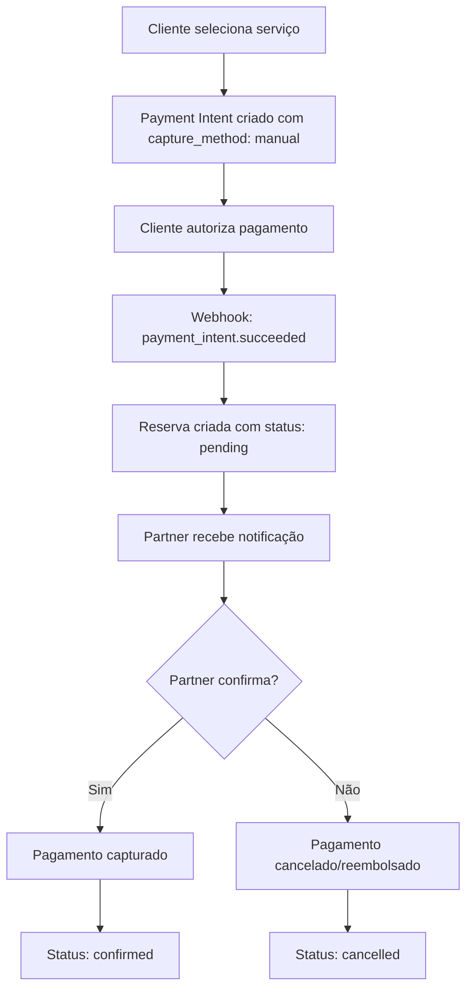

# 🏨 Sistema de Reservas com Pagamentos Stripe - Documentação Técnica

## 📋 Visão Geral

Este documento detalha a implementação completa do sistema de reservas com pagamentos obrigatórios usando Stripe, desenvolvido para a plataforma Tucano Noronha.

### ✨ Características Principais

- **Payment-First Approach**: Pagamento obrigatório antes da criação de reservas
- **Authorization + Manual Capture**: Autorização imediata, captura após confirmação do partner
- **Refund Automático**: Processamento automático de reembolsos em caso de cancelamento
- **Dashboard Integrado**: Interface completa para partners gerenciarem reservas
- **Cron Jobs**: Limpeza automática de autorizações expiradas

---

## 🏗️ Arquitetura do Sistema

### **Fluxo de Pagamento (Authorization-First)**



### **Estados de Reserva**

| Status | Descrição | Ação do Pagamento |
|--------|-----------|-------------------|
| `pending` | Aguardando confirmação do partner | Autorizado (não capturado) |
| `confirmed` | Confirmada pelo partner | Capturado |
| `cancelled` | Cancelada pelo partner | Cancelado/Reembolsado |

---

## 📊 Schema do Banco de Dados

### **Campos Adicionados às Tabelas de Booking**

```typescript
// Campos adicionados a: activityBookings, eventBookings, vehicleBookings, etc.
{
  paymentIntentId: v.optional(v.string()),        // Stripe PaymentIntent ID
  paymentCaptured: v.optional(v.boolean()),        // Se o pagamento foi capturado
  refundId: v.optional(v.string()),                // Stripe Refund ID se aplicável
  refundStatus: v.optional(v.string()),            // Status do refund: pending, succeeded, failed
  cancellationReason: v.optional(v.string()),      // Motivo do cancelamento
}
```

---

## 🛠️ Implementação Técnica

### **1. Mutations Principais**

#### **Criação de Reservas com Pagamento**
```typescript
// convex/domains/bookings/mutations.ts
export const createActivityBookingWithPayment = mutation({
  // Chamada pelo webhook após autorização
  // Cria reserva com status: "pending" e paymentStatus: "authorized"
});

export const createEventBookingWithPayment = mutation({
  // Similar para eventos
});
```

#### **Confirmação e Cancelamento pelo Partner**
```typescript
export const confirmBookingByPartner = mutation({
  // Atualiza status para "confirmed"
  // Agenda captura do pagamento via action
});

export const cancelBookingByPartner = mutation({
  // Atualiza status para "cancelled" 
  // Agenda refund/cancelamento via action
});
```

### **2. Actions de Pagamento**

```typescript
// convex/domains/payments/actions.ts
export const captureStripePayment = action({
  // Captura pagamento autorizado quando partner confirma
});

export const cancelStripePayment = action({
  // Cancela autorização quando partner rejeita
});

export const refundStripePayment = action({
  // Processa reembolso para pagamentos já capturados
});
```

### **3. Endpoints de API**

#### **Payment Intent Creation**
```typescript
// src/app/api/stripe/create-payment-intent/route.ts
{
  capture_method: "manual",  // ✅ Autorização manual
  metadata: {
    flow: "reservation_system",
    bookingType,
    bookingData: JSON.stringify(bookingData)
  }
}
```

#### **Webhook Handler**
```typescript
// src/app/api/stripe/webhook/route.ts
case "payment_intent.succeeded": {
  if (intent.capture_method === "manual") {
    // Criar reserva com status "pending"
    await createBookingAfterAuthorization();
  }
}
```

### **4. Queries para Dashboard**

```typescript
// convex/domains/bookings/queries.ts
export const getPendingBookingsForPartner = query({
  // Lista reservas pendentes por partner
});

export const getPaymentSummaryForPartner = query({
  // Resumo financeiro: receitas, reembolsos, etc.
});

export const getBookingDetailsForPartner = query({
  // Detalhes completos de uma reserva específica
});
```

---

## 🎨 Interface do Partner

### **Dashboard Component**
```typescript
// src/components/dashboard/PartnerBookingsDashboard.tsx
<Tabs>
  <TabsTrigger value="pending">Pendentes</TabsTrigger>
  <TabsTrigger value="confirmed">Confirmadas</TabsTrigger>
  <TabsTrigger value="cancelled">Canceladas</TabsTrigger>
</Tabs>
```

#### **Funcionalidades:**
- ✅ Visualização de reservas pendentes com pagamento autorizado
- ✅ Confirmação com captura automática de pagamento
- ✅ Cancelamento com reembolso automático
- ✅ Timeline de eventos da reserva
- ✅ Resumo financeiro em tempo real

---

## ⏰ Cron Jobs e Automação

### **Limpeza de Autorizações Expiradas**
```typescript
// convex/domains/payments/crons.ts
export const cancelExpiredAuthorizations = internalAction({
  // Executa a cada 4 horas
  // Cancela autorizações com mais de 6 dias
  // Atualiza status das reservas relacionadas
});
```

### **Configuração**
```typescript
// convex/crons.ts
crons.interval(
  "cancel_expired_authorizations", 
  { hours: 4 }, 
  internal.domains.payments.crons.cancelExpiredAuthorizations
);
```

---

## 📧 Sistema de Notificações

### **Emails Automáticos**

| Evento | Destinatário | Template |
|--------|--------------|----------|
| Reserva autorizada | Cliente | Confirmação pendente |
| Nova reserva | Partner | Notificação de nova reserva |
| Reserva confirmada | Cliente | Confirmação final |
| Reserva cancelada | Cliente | Cancelamento + reembolso |

### **Implementação**
```typescript
// convex/domains/email/actions.ts
export const sendBookingStatusUpdateEmail = internalAction({
  // Notifica mudanças de status para o cliente
});
```

---

## 🔒 Segurança e Validações

### **Verificações de Permissão**
- ✅ Apenas partners podem confirmar/cancelar suas próprias reservas
- ✅ Validação de ownership do asset
- ✅ Verificação de status antes de ações

### **Rate Limiting**
- ✅ Limite de tentativas de criação de reservas
- ✅ Rate limiting por usuário aplicado

### **Validação de Dados**
- ✅ Validação de email e telefone
- ✅ Verificação de disponibilidade de assets
- ✅ Validação de limites de participantes

---

## 🚀 Como Usar

### **1. Para Implementar em Novo Asset**

```typescript
// 1. Adicionar campos de pagamento ao schema
// 2. Criar mutation *WithPayment correspondente
// 3. Atualizar webhook para suportar o novo tipo
// 4. Adicionar ao dashboard do partner
```

### **2. Para Testarmento**

```bash
# 1. Configurar webhook endpoint no Stripe Dashboard
# 2. Usar Stripe CLI para testes locais
stripe listen --forward-to localhost:3000/api/stripe/webhook

# 3. Criar payment intent de teste
curl -X POST localhost:3000/api/stripe/create-payment-intent \
  -H "Content-Type: application/json" \
  -d '{"amount": 5000, "bookingType": "activity", "bookingData": {...}}'
```

---

## 📈 Monitoramento e Logs

### **Logs Importantes**
- ✅ Todas as transações de pagamento logadas
- ✅ Emails enviados registrados no banco
- ✅ Erros de webhook capturados
- ✅ Timeline de eventos por reserva

### **Métricas Dashboard**
- ✅ Receita total por partner
- ✅ Número de reservas pendentes
- ✅ Valor de reembolsos processados
- ✅ Taxa de confirmação vs cancelamento

---

## 🔧 Troubleshooting

### **Problemas Comuns**

| Problema | Causa Provável | Solução |
|----------|----------------|---------|
| Webhook não recebido | URL ou secret incorreto | Verificar configuração Stripe |
| Pagamento não capturado | Error na action | Verificar logs do Convex |
| Reserva não criada | Dados inválidos no metadata | Validar estrutura do payload |
| Email não enviado | Configuração SMTP | Verificar service de email |

### **Comandos de Debug**
```typescript
// Verificar status de um payment intent
const intent = await stripe.paymentIntents.retrieve('pi_xxx');

// Listar autorizações expiradas
const expiredAuths = await ctx.db
  .query("activityBookings")
  .withIndex("by_payment_status", q => q.eq("paymentStatus", "authorized"))
  .filter(q => q.lt(q.field("createdAt"), Date.now() - 6 * 24 * 60 * 60 * 1000))
  .collect();
```

---

## 🔄 Próximos Passos

### **Melhorias Planejadas**
- [ ] Implementar sistema para veículos e acomodações
- [ ] Dashboard analytics avançado
- [ ] Notificações push em tempo real
- [ ] Sistema de disputas automatizado
- [ ] Integração com sistema de fidelidade

### **Otimizações**
- [ ] Cache de queries frequentes
- [ ] Batch processing para emails
- [ ] Compression de payloads webhook
- [ ] Retry logic melhorado

---

## 📚 Recursos Adicionais

### **Documentação Stripe**
- [Payment Intents API](https://stripe.com/docs/api/payment_intents)
- [Manual Capture](https://stripe.com/docs/payments/capture-later)
- [Webhooks](https://stripe.com/docs/webhooks)

### **Convex Resources**
- [Mutations](https://docs.convex.dev/functions/mutations)
- [Actions](https://docs.convex.dev/functions/actions)
- [Cron Jobs](https://docs.convex.dev/scheduling/cron-jobs)

---

*Sistema implementado com sucesso em [data] para Tucano Noronha*
*Versão: 1.0.0* 